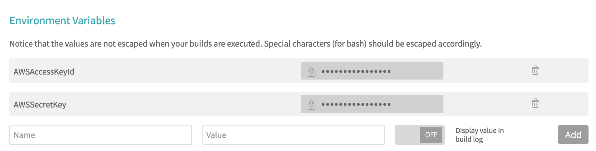
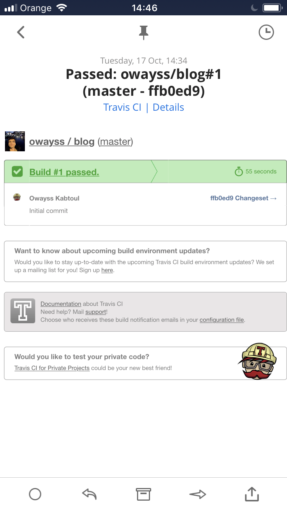

Today I thought I would tell you about how this blog was set up, since I have only recently moved it to AWS.

The blog is powered by [Hugo](https://gohugo.io), hosted on [Amazon's S3](https://aws.amazon.com/s3), and uses [Travis CI](https://travis-ci.org) for automating builds & deployments.


## The site itself
The website is powered by Hugo, an open-source static site generator written in Go. It is incredibly fast and takes very little amount of time to set up. I will not into much detail on how to create a Hugo site, as their [docs](https://gohugo.io/getting-started/) are clear and extremely easy to follow.

So, assuming you have generated a static website and can verify locally that is is working properly Hugo's test server (`hugo server -D`), how would you deploy the site to S3?

---

## Hosting a static website on S3
One nice feature of Amazon's Simple Storage Service is that buckets can be configured for static hosting of websites.

##### Creating a S3 bucket
Assuming you have the [AWS CLI](http://docs.aws.amazon.com/cli/latest/userguide/installing.html) installed, the following command will create a S3 bucket for you. The bucket is going to have the name specified in `$BUCKET_NAME` and will reside in the region specified in the `$AWS_REGION` environment variable:
```sh
BUCKET_NAME="owayss.me"
AWS_REGION="eu-west-1"
aws s3api create-bucket --bucket $BUCKET_NAME \
    --region $AWS_REGION
```
Keep in mind that S3 buckets names should be globally unique; there can not be two S3 buckets with the same name at any given moment.

##### Configure the bucket for website hosting
Having created the S3 bucket, the next thing we need to do is configure it for static website hosting. This can be done with the following command:
```sh
aws s3api put-bucket-website --bucket $BUCKET_NAME \
    --website-configuration file://website-config.json
```

`website-config.json` is a JSON file that we are going to use to provide the path for the index and error documents for our website. It can also be used to setup redirection rules. 
```json
{
    "IndexDocument": {
        "Suffix": "index.html"
    },
    "ErrorDocument": {
        "Key": "error.html"
    }
}
```


##### Bucket policy
Finally, we will add a bucket policy.
This policy is used to give permissions to an entity (in our case, it is going to be the Travis CI service) to set the [Access Control List](http://docs.aws.amazon.com/AmazonS3/latest/dev/acl-overview.html) of the files it is going to upload to the S3 bucket. We need that so the service can set the access type to `public_read` in order for the website files to be publicly accessible by anyone on the internet.
```sh 
aws s3api put-bucket-policy --bucket $BUCKET_NAME \
    --policy file://policy.json
```

The `policy.json` file:
```json
{
    "Version": "2012-10-17",
    "Statement": [
        {
            "Sid": "AllowPublicRead",
            "Effect": "Allow",
            "Principal": {
                "AWS": "Principal"
            },
            "Action": [
                "s3:AbortMultipartUpload",
                "s3:DeleteObject",
                "s3:GetObject",
                "s3:GetObjectAcl",
                "s3:PutObject",
                "s3:PutObjectAcl"
            ],
            "Resource": "arn:aws:s3:::BucketName/*"
        }
    ]
}
```

Be sure to change the "Principal" and "BucketName" fields to your [AWS account's ARN](http://docs.aws.amazon.com/AmazonS3/latest/dev/s3-bucket-user-policy-specifying-principal-intro.html) and bucket's name.

---

## Automating builds and deployments using Travis CI
Travis CI is a continuos integration platform. It has an open source version `travis-ci.org` that integrates nicely with Github hosted code repositories.
We are going to use Travis CI mainly to do two things:

* Automate builds: whenever a new commit is pushed to the `owayss/blog` repository on Github, we are going to trigger a new build of our Hugo site.
* Automate deployments: if the build succeeds, we are going to have the Travis CI service deploy the content rendered by Hugo to our S3 bucket.  


To do that we would have to create travis-ci.org account, sync our public repositories from Github, and give Travis CI permission to the ones we want to work with. Following the [docs](https://docs.travis-ci.com/user/getting-started/) this process is pretty straightforward.

The next thing we need to do is add a `.travis.yml` file to our repository to tell Travis CI what to do.
The one for this blog looks like this:

```yaml
env:
  - HUGO_VERSION="hugo_0.30_Linux-64bit.deb"
  - HUGO_DEB="v0.30"

before_install:
  - wget https://github.com/gohugoio/hugo/releases/download/${HUGO_VERSION}/${HUGO_DEB}
  - sudo dpkg -i ${HUGO_DEB}

script:
  - hugo

deploy:
  provider: s3
  access_key_id: ${AWSAccessKeyId}
  secret_access_key: ${AWSSecretKey}
  bucket: "owayss.me"
  region: "eu-west-1"
  local_dir: public
  acl: public_read
  skip_cleanup: true  
```
This tells Travis CI that the Hugo dependency needs to be installed before the build process. We install Hugo by downloading a release from their Github repository and installing it wht `dpkg` (the default environment for Travis CI is an Ubuntu trusty 14.04 image).

You should have noticed the use of environment variables in the `.travis.yml` file. This is a way of customizing the build process. Environment variables can either be defined in the same YAML file, which is what we have done with the `HUGO_VERSION` and `HUGO_DEB` variables, or, if the variables contain sensitive information, they can be defined in the [repository settings](https://docs.travis-ci.com/user/environment-variables/#Defining-Variables-in-Repository-Settings) on your Travis CI account. This is the case for our AWS secret access keys, `AWSAccessKeyId` and `AWSSecretKey` that the Travis CI service needs in order to be able to push our build to the S3 bucket using the AWS CLI.



Another important thing to note regarding the `.travis.yml` file is the use of:
```
skip_cleanup: true
```

This is to tell Travis CI to not clean build artifacts directly after finishing the build process, since the build directory containing the rendered content, `public`, is not committed to the repository.

---

## Adding new content
Now, whenever I want to add new content, I just write a new markdown file, commit it to the repository, push to Github, and sip on my tea while waiting for Travis CI to tell me that it had successfully built & deployed the content to S3.

