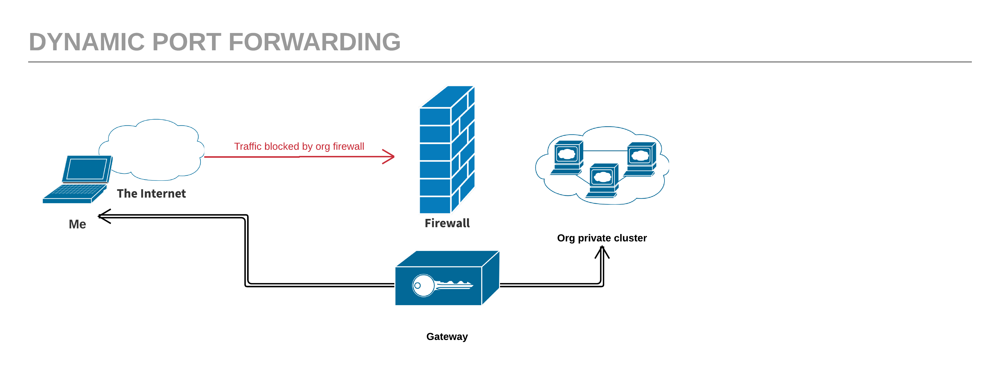

Recently I needed to SSH into a machine located in a private network on my organization's wide area network. The WAN has a firewall that blocks all traffic coming from the outside (the internet) to access any of the machines in the internal cluster. This lead me to learn about port forwarding.

## Port forwarding
Port forwarding is a mechanism used for tunneling application ports form client to server (or vice versa) by routing traffic through an intermediate gateway. It can be used for adding encryption to insecure traffic coming from legacy applications, or to bypass firewalls allows remote computers. The latter is very useful for opening back-doors into internal networks.

Essentially, port forwarding can be divided into three types: **local**, **remote**, and **dynamic**.

Local port forwarding, as its name suggests, forwards traffic coming to a specific local port to a remote one. A typical use case of local forwarding is to have route incoming SSH access through a single _jump server_. 

Remote port forwarding does exactly the opposite; it forwards traffic coming to a remote port to a local one. This is frequently used to expose an internal web service to the public internet.

And last but not least, **dynamic port forwarding**. Where as both local and remote forwarding only allow interaction on a single port, dynamic forwarding allows a full range of TCP communication across a range of ports.



## The gist

#### Local port forwarding
On the `work` machine, run the following command:
```sh
ssh -L 8080:youtube.com:80 home
```

The `L` option binds port 8080 of localhost to listen for local requests from port 80 of `home`, thus creating a tunnel that routes all HTTP requests that are made to youtube.com through the `home` machine, making it possible to access the site from our `work` machine. 

#### Remote port forwarding
On the `work` machine, run the following command:
```sh
ssh -R 9000:site.myorg.com:80 home
```
The `R` option creates a reverse tunnel, to allow forwarding of outgoing traffic. This way we can browse our internal organization site (site.myorg.com) from home by routing outgoing traffic from the site.myorg.com through the reverse SSH tunnel that gets created between the `work` and `home` machines. 

#### Dynamic port forwarding
##### Setting up the SOCKS proxy server
```sh
ssh -DN 1080 user@gateway
```
The `N` option is to tell the SSH client that no command will be sent once the tunnel is up. The `D` is for dynamic forwarding. 

The previous command turns our SSH client into a SOCKS proxy server. The SOCKS protocol is used to route any internet connection through a proxy server. For instance, we can tell our browser to request every webpage through the encrypted SSH tunnel:
```
open -a "Google Chrome" --args --proxy-server=socks5://localhost:1080
```

##### Accessing the target machine
```sh
ssh -o ProxyCommand='nc -x 127.0.0.1:1080 %h %p' user@target.myorg
```